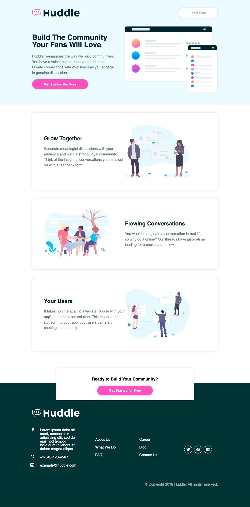

# Frontend Mentor - Huddle landing page with alternating feature blocks solution

This is a solution to the [Huddle landing page with alternating feature blocks challenge on Frontend Mentor](https://www.frontendmentor.io/challenges/huddle-landing-page-with-alternating-feature-blocks-5ca5f5981e82137ec91a5100). Frontend Mentor challenges help you improve your coding skills by building realistic projects. 

## Table of contents

- [Overview](#overview)
  - [The challenge](#the-challenge)
  - [Screenshot](#screenshot)
  - [Links](#links)
- [My process](#my-process)
  - [Built with](#built-with)
  - [What I learned](#what-i-learned)
  - [Useful resources](#useful-resources)
- [Author](#author)

## Overview

### The challenge

Users should be able to:

- View the optimal layout for the site depending on their device's screen size
- See hover states for all interactive elements on the page

### Screenshots

**Desktop View**

**Mobile View**

### Links

- Solution URL: [Add solution URL here](https://your-solution-url.com)
- Live Site URL: [Add live site URL here](https://your-live-site-url.com)

## My process

### Built with

- Flexbox
- [React](https://reactjs.org/) - JS library
- [Styled Components](https://styled-components.com/) - For styles

### What I learned

This is my first time using styled components, I really enjoyed it! 

I followed this [Turotial](https://www.youtube.com/watch?v=02zO0hZmwnw) by Brad Travery, It was a super helpful tutorial and went through most of the project,
 I was able to go through at then end and add in some bits he didn't go through and make any changes. 

### Useful resources

- [Brad Traversy](https://www.youtube.com/channel/UC29ju8bIPH5as8OGnQzwJyA) - Great Youtuber.

## Author

- Website - [Alice Menzie](https://www.alicemenzie.devgithub)
- Frontend Mentor - [@AliceMenzie](https://www.frontendmentor.io/profile/AliceMenzie)
- GitHub - [AliceMenzie](https://github.com/AliceMenzie)

